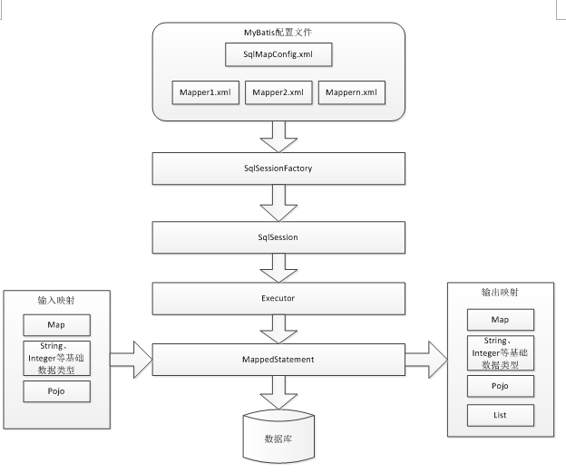

## 1.Mybatis所处的位置
Mybatis处在持久层，和数据库打交道

## 2.为什么需要Mybatis
引入MyBatis的目的：主要是为了弥补JDBC的硬编码问题：
 1. 解决频发链接数据库
 2. 解决sql代码的硬编码
 3. 解决占位符硬编码
 4. 解决结果集硬编码
<!-- more -->
## 3.架构

## 4.我们使用Mybatis需要做的事
1. 配置SqlMapConfig.xml，Mybatis全局配置文件
2. mapper.xml,存放sql语句的文件
3. 通过sqlSessionFactory获取session进行操作，但这些都是Mybatis环境帮我们做的

## 5.入门程序
1.	创建java项目
2.	创建lib目录导入jar


3.	编写SqlMapConfig.xml文件，在classpath下创建SqlMapConfig.xml,它的任务是数据源、事务管理，但是在后面这些事都是Spring进行整合，所以后面它的工作只是配置mapper.xml
```xml
<?xml version="1.0" encoding="UTF-8" ?>
<!DOCTYPE configuration
PUBLIC "-//mybatis.org//DTD Config 3.0//EN"
"http://mybatis.org/dtd/mybatis-3-config.dtd">
<configuration>
	<!-- 和spring整合后 environments配置将废除-->
	<environments default="development">
		<environment id="development">
		<!-- 使用jdbc事务管理-->
			<transactionManager type="JDBC" />
		<!-- 数据库连接池-->
			<dataSource type="POOLED">
				<property name="driver" value="com.mysql.jdbc.Driver" />
				<property name="url" value="jdbc:mysql://localhost:3306/mybatis?characterEncoding=utf-8" />
				<property name="username" value="root" />
				<property name="password" value="root" />
			</dataSource>
		</environment>
	</environments>
	
</configuration>

```

4.	编写po类,Po类作为mybatis进行sql映射使用，po类通常与数据库表对应

```java
public class User {
	private int id;
	private String username;// 用户姓名
	private String sex;// 性别
	private Date birthday;// 生日
	private String address;// 地址


```
5.	编写对应po类的映射文件，发现映射文件的名字可以和po的名字不一样,在classpath下的sqlmap目录下创建sql映射文件Users.xml

```xml
<?xml version="1.0" encoding="UTF-8" ?>
<!DOCTYPE mapper
PUBLIC "-//mybatis.org//DTD Mapper 3.0//EN"
"http://mybatis.org/dtd/mybatis-3-mapper.dtd">
<mapper namespace="test">
</mapper>

```
6.	SqlMapConfig导入映射文件,将Users.xml添加在SqlMapConfig.xml

```xml
<mappers>
		<mapper resource="sqlmap/User.xml"/>
</mappers>

```
7.	在映射文件中编写sql语句,根据id查找用户信息，在user.xml中添加

```java
<!-- 根据id获取用户信息 -->
	<select id="findUserById" parameterType="int" resultType="cn.itcast.mybatis.po.User">
		select * from user where id = #{id}
	</select>

parameterType：定义输入到sql中的映射类型，#{id}表示使用preparedstatement设置占位符号并将输入变量id传到sql。
resultType：定义结果映射类型。

```
8.	编写测试程序 
```java
public class Mybatis_first {
	
	//会话工厂
	private SqlSessionFactory sqlSessionFactory;

	@Before
	public void createSqlSessionFactory() throws IOException {
		// 配置文件
		String resource = "SqlMapConfig.xml";
		InputStream inputStream = Resources.getResourceAsStream(resource);

		// 使用SqlSessionFactoryBuilder从xml配置文件中创建SqlSessionFactory
		sqlSessionFactory = new SqlSessionFactoryBuilder()
				.build(inputStream);

	}

	// 根据 id查询用户信息
	@Test
	public void testFindUserById() {
		// 数据库会话实例
		SqlSession sqlSession = null;
		try {
			// 创建数据库会话实例sqlSession
			sqlSession = sqlSessionFactory.openSession();
			// 查询单个记录，根据用户id查询用户信息
			User user = sqlSession.selectOne("test.findUserById", 10);
			// 输出用户信息
			System.out.println(user);
		} catch (Exception e) {
			e.printStackTrace();
		} finally {
			if (sqlSession != null) {
				sqlSession.close();
			}
		}

	}
}

```

## Mybatis和Hibernate的区别
Mybatis和hibernate不同，它不完全是一个ORM框架，因为MyBatis需要程序员自己编写Sql语句，不过mybatis可以通过XML或注解方式灵活配置要运行的sql语句，并将java对象和sql语句映射生成最终执行的sql，最后将sql执行的结果再映射生成java对象。   
Mybatis学习门槛低，简单易学，程序员直接编写原生态sql，可严格控制sql执行性能，灵活度高，非常适合对关系数据模型要求不高的软件开发，例如互联网软件、企业运营类软件等，因为这类软件需求变化频繁，一但需求变化要求成果输出迅速。但是灵活的前提是mybatis无法做到数据库无关性，如果需要实现支持多种数据库的软件则需要自定义多套sql映射文件，工作量大。   
Hibernate对象/关系映射能力强，数据库无关性好，对于关系模型要求高的软件（例如需求固定的定制化软件）如果用hibernate开发可以节省很多代码，提高效率。但是Hibernate的学习门槛高，要精通门槛更高，而且怎么设计O/R映射，在性能和对象模型之间如何权衡，以及怎样用好Hibernate需要具有很强的经验和能力才行。
总之，按照用户的需求在有限的资源环境下只要能做出维护性、扩展性良好的软件架构都是好架构，所以框架只有适合才是最好。

## SqlSession和SqlSessionFactoryBuilder以及SqlSessionFactory
1. SqlSession中封装了对数据库的操作，如：查询、插入、更新、删除等。通过SqlSessionFactory创建SqlSession，而SqlSessionFactory是通过SqlSessionFactoryBuilder进行创建。SqlSession是一个面向用户的接口， sqlSession中定义了数据库操作方法。每个线程都应该有它自己的SqlSession实例。SqlSession的实例不能共享使用，它也是线程不安全的。因此最佳的范围是请求或方法范围。绝对不能将SqlSession实例的引用放在一个类的静态字段或实例字段中。打开一个 SqlSession；使用完毕就要关闭它。通常把这个关闭操作放到 finally 块中以确保每次都能执行关闭。

2. SqlSessionFactoryBuilder用于创建SqlSessionFacoty，SqlSessionFacoty一旦创建完成就不需要SqlSessionFactoryBuilder了，因为SqlSession是通过SqlSessionFactory生产，所以可以将SqlSessionFactoryBuilder当成一个工具类使用，最佳使用范围是方法范围即方法体内局部变量。
3. SqlSessionFactory是一个接口，接口中定义了openSession的不同重载方法，SqlSessionFactory的最佳使用范围是整个应用运行期间，一旦创建后可以重复使用，通常以单例模式管理SqlSessionFactory。

## 在DAO中使用Mybatis进行开发
1. 传统方式：该方式需要定义dao接口和实现类
  1. 编写接口和实现类
  2. 编写映射文件User.xml并根据需要，码上sql语句
2. 传统方式存在的问题：
  1. Dao方法体存在重复代码：通过SqlSessionFactory创建SqlSession，调用SqlSession的数据库操作方法
  2. 调用sqlSession的数据库操作方法需要指定statement的id，这里存在硬编码，不利于开发维护。

## 原始DAO开发流程
1.	创建Java工程
2.	创建lib目录并导入jar包
3.	编写SqlMapConfig.xml
4.	编写po类和对应的映射文件
```java
<?xml version="1.0" encoding="UTF-8" ?>
<!DOCTYPE mapper
PUBLIC "-//mybatis.org//DTD Mapper 3.0//EN"
"http://mybatis.org/dtd/mybatis-3-mapper.dtd">
<mapper namespace="test">
<!-- 根据id获取用户信息 -->
	<select id="findUserById" parameterType="int" resultType="cn.itcast.mybatis.po.User">
		select * from user where id = #{id}
	</select>
<!-- 添加用户 -->
	<insert id="insertUser" parameterType="cn.itcast.mybatis.po.User">
	<selectKey keyProperty="id" order="AFTER" resultType="java.lang.Integer">
		select LAST_INSERT_ID() 
	</selectKey>
	  insert into user(username,birthday,sex,address) 
	  values(#{username},#{birthday},#{sex},#{address})
	</insert>
</mapper>

```

5.	编写UserDao接口和实现类，**其实就是dao分担了测试程序的通过sqlsession进行操作的东西**
```java
Public interface UserDao {
	public User getUserById(int id) throws Exception;
	public void insertUser(User user) throws Exception;
}

Public class UserDaoImpl implements UserDao {
	
	//注入SqlSessionFactory
	public UserDaoImpl(SqlSessionFactory sqlSessionFactory){
		this.setSqlSessionFactory(sqlSessionFactory);
	}
	
	private SqlSessionFactory sqlSessionFactory;
	@Override
	public User getUserById(int id) throws Exception {
		SqlSession session = sqlSessionFactory.openSession();
		User user = null;
		try {
			//通过sqlsession调用selectOne方法获取一条结果集
			//参数1：指定定义的statement的id,参数2：指定向statement中传递的参数
			user = session.selectOne("test.findUserById", 1);
			System.out.println(user);
						
		} finally{
			session.close();
		}
		return user;
	}
	
	@Override
	Public void insertUser(User user) throws Exception {
		SqlSession sqlSession = sqlSessionFactory.openSession();
		try {
			sqlSession.insert("insertUser", user);
			sqlSession.commit();
		} finally{
			session.close();
		}
		
	}
}

```

6.	在实现类中，责任便是之前在测试类中的通过SqlSession来进行业务处理，除了加载全局配置文件以外——这就是Dao的目的，就是代替之前测试类干的事儿
7.	编写测试类
```java
private SqlSessionFactory sqlSessionFactory;
	
	@Before
	public void init() throws Exception {
		SqlSessionFactoryBuilder sessionFactoryBuilder = new SqlSessionFactoryBuilder();
		InputStream inputStream = Resources.getResourceAsStream("SqlMapConfig.xml");
		sqlSessionFactory = sessionFactoryBuilder.build(inputStream);
	}

	@Test
	public void testGetUserById() {
		UserDao userDao = new UserDaoImpl(sqlSessionFactory);
		User user = userDao.getUserById(22);
		System.out.println(user);
	}
}

```
## 使用原生dao开发的弊端
1. Dao方法体存在重复代码：通过SqlSessionFactory创建SqlSession，调用SqlSession的数据库操作方法
2. 调用sqlSession的数据库操作方法需要指定statement的id，这里存在硬编码，不利于开发维护。

## 使用Mapper动态代理的方式

Mapper接口开发方法只需要程序员编写Mapper接口（相当于Dao接口），由Mybatis框架根据接口定义创建接口的动态代理对象，代理对象的方法体同上边Dao接口实现类方法。
### Mapper代理方式需要遵循的规范：
  1. Mapper.xml文件中的namespace与mapper接口的类路径相同。
  2. Mapper接口方法名和Mapper.xml中定义的每个statement的id相同
  3. Mapper接口方法的输入参数类型和mapper.xml中定义的每个sql 的parameterType的类型相同
  4. Mapper接口方法的输出参数类型和mapper.xml中定义的每个sql的resultType的类型相同

### Mapper方式的开发步骤
1.	创建Java项目
2.	创建lib目录并导入jar包
3.	创建PO类文件
4.	编写全局配置文件
5.	创建Mapper接口（相当于Dao开发中的接口）
```java
/**
 * 用户管理mapper
 */
Public interface UserMapper {
	//根据用户id查询用户信息
	public User findUserById(int id) throws Exception;
	//查询用户列表
	public List<User> findUserByUsername(String username) throws Exception;
	//添加用户信息
	public void insertUser(User user)throws Exception; 
}

```

6.	创建和Mapper接口对应的映射文件，注意规范,XxxMapper.xml(映射文件)
```java
<?xml version="1.0" encoding="UTF-8" ?>
<!DOCTYPE mapper
PUBLIC "-//mybatis.org//DTD Mapper 3.0//EN"
"http://mybatis.org/dtd/mybatis-3-mapper.dtd">
<mapper namespace="cn.itcast.mybatis.mapper.UserMapper">
<!-- 根据id获取用户信息 -->
	<select id="findUserById" parameterType="int" resultType="cn.itcast.mybatis.po.User">
		select * from user where id = #{id}
	</select>
<!-- 自定义条件查询用户列表 -->
	<select id="findUserByUsername" parameterType="java.lang.String" 
			resultType="cn.itcast.mybatis.po.User">
	   select * from user where username like '%${value}%' 
	</select>
<!-- 添加用户 -->
	<insert id="insertUser" parameterType="cn.itcast.mybatis.po.User">
	<selectKey keyProperty="id" order="AFTER" resultType="java.lang.Integer">
		select LAST_INSERT_ID() 
	</selectKey>
	  insert into user(username,birthday,sex,address) 
	  values(#{username},#{birthday},#{sex},#{address})
	</insert>

</mapper>

```
7.	加载配置文件
```java
<!-- 加载映射文件 -->
  <mappers>
    <mapper resource="mapper/UserMapper.xml"/>
  </mappers>

```

8.	编写测试类
```java
Public class UserMapperTest extends TestCase {

	private SqlSessionFactory sqlSessionFactory;
	
	protected void setUp() throws Exception {
		//mybatis配置文件
		String resource = "sqlMapConfig.xml";
		InputStream inputStream = Resources.getResourceAsStream(resource);
		//使用SqlSessionFactoryBuilder创建sessionFactory
		sqlSessionFactory = new SqlSessionFactoryBuilder().build(inputStream);
	}

	
	Public void testFindUserById() throws Exception {
		//获取session
		SqlSession session = sqlSessionFactory.openSession();
		//获取mapper接口的代理对象
		UserMapper userMapper = session.getMapper(UserMapper.class);
		//调用代理对象方法
		User user = userMapper.findUserById(1);
		System.out.println(user);
		//关闭session
		session.close();
		
	}

```

## 其他
为知笔记
