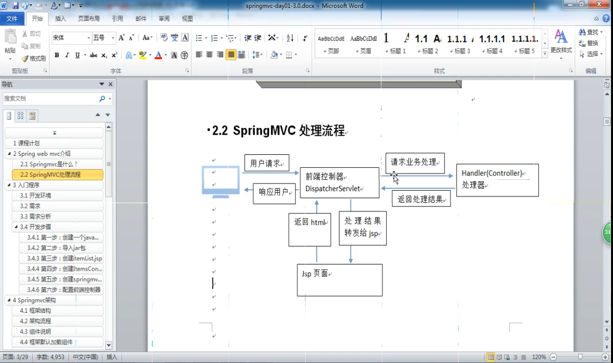
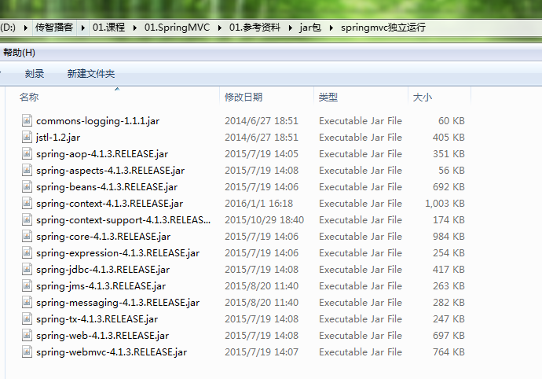
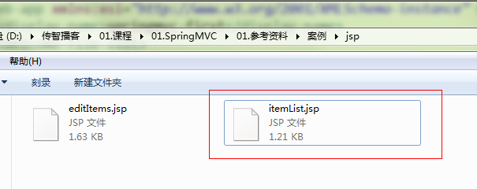

## 1.SpringMVC有什么用
1. 表现层，负责接收用户的数据和分配处理以及分发转向
2. 处理流程：
<!-- more -->

## 2.入门程序
1.	创建web工程
2.	导入jar包


3.	创建listItem.jsp


4.	创建ItemController，temController是一个普通的java类，不需要实现任何接口，只需要在类上添加@Controller注解即可。@RequestMapping注解指定请求的url，其中“.action”可以加也可以不加。在ModelAndView对象中，将视图设置为“/WEB-INF/jsp/itemList.jsp”
```java
@Controller
publicclass ItemController {

	@RequestMapping("/itemList")
	public ModelAndView itemList() throws Exception {
		
		List<Items>itemList = new ArrayList<>();
		
		//商品列表
		Items items_1 = new Items();
		items_1.setName("联想笔记本_3");
		items_1.setPrice(6000f);
		items_1.setDetail("ThinkPad T430 联想笔记本电脑！");
		
		Items items_2 = new Items();
		items_2.setName("苹果手机");
		items_2.setPrice(5000f);
		items_2.setDetail("iphone6苹果手机！");
		
		itemList.add(items_1);
		itemList.add(items_2);
		//创建modelandView对象
		ModelAndView modelAndView = new ModelAndView();
		//添加model
		modelAndView.addObject("itemList", itemList);
		//添加视图
		modelAndView.setViewName("/WEB-INF/jsp/itemList.jsp");
//		modelAndView.setViewName("itemsList");	
		returnmodelAndView;
	}

}

```

5.	创建SpringMVC.xml，相当于struts中的struts.xml进行配置转向
```xml
<?xmlversion="1.0"encoding="UTF-8"?>
<beansxmlns="http://www.springframework.org/schema/beans"
	xmlns:xsi="http://www.w3.org/2001/XMLSchema-instance"xmlns:p="http://www.springframework.org/schema/p"
	xmlns:context="http://www.springframework.org/schema/context"
	xmlns:dubbo="http://code.alibabatech.com/schema/dubbo"xmlns:mvc="http://www.springframework.org/schema/mvc"
	xsi:schemaLocation="http://www.springframework.org/schema/beans http://www.springframework.org/schema/beans/spring-beans-4.0.xsd
        http://www.springframework.org/schema/mvc http://www.springframework.org/schema/mvc/spring-mvc-4.0.xsd
        http://code.alibabatech.com/schema/dubbo http://code.alibabatech.com/schema/dubbo/dubbo.xsd
        http://www.springframework.org/schema/context http://www.springframework.org/schema/context/spring-context-4.0.xsd">

	<context:component-scanbase-package="cn.itcast.springmvc.controller"/>
	
</beans>

```

6.	配置前端控制器，在web.xml中添加DispatcherServlet的配置。

```xml
<!-- 前端控制器 -->
<servlet>
	<servlet-name>springmvc</servlet-name>
	<servlet-class>org.springframework.web.servlet.DispatcherServlet</servlet-class>
	<init-param>
		<param-name>contextConfigLocation</param-name>
		<param-value>classpath:springmvc.xml</param-value>
	</init-param>
</servlet>
<servlet-mapping>
	<servlet-name>springmvc</servlet-name>
	<url-pattern>*.action</url-pattern>
</servlet-mapping>

```


## 3.SpringMVC架构
## 架构流程
- 用户发送请求
- 前端控制器接收
- 控制器把请求发送给处理器映射器，（url到请求方法的映射）@RequestMapping(/abc),它的内部就类似于一个hashMap
- 返回处理器执行莲(拦截器，拦截请求，主要在权限的时候用)，拦住了就不执行方法，没拦住就执行方法并返回handler处理器给前端控制器
- 前端发送handler给处理器适配器，由适配器按照用户的要求是用注解或非注解的形式去调用controller中的handler
- (注意)适配器就是注解与否，handler就是类似于action的controller
- 处理器适配器就是，根据不同的handler找到不同的处理器适配器去执行handler
-handler处理器进行controller处理，返回ModelAndView，model放的是返回个页面的数据，View装的是返回到哪个页面
- modelAndView返回到前端控制器，
- 前端控制器接着找到视图解析器，让视图解析器解析视图（springMVC特有的）
- 视图最常见的是jsp，pdf，freemarker等也算，但是动态网站都是动态加载，但是慢，静态网站就是加载比较快，所以有了freemarker模板
- 视图解析器根据不同的视图进行解析，返回view对象
- 解析完之后，进行视图的渲染，拼成html
- 将html返回给用户

## 我们要写的有哪些？
- handler（controller）
- 分配什么适配器，具体的适配器不需要我们写
- 视图,也就是页面
## 4.SpringMVC整合Mybatis
## 5.参数绑定
## 6.高级参数绑定
## 7.Spring注解以及@RequestMapping注解的使用
## 8.Controller返回值
## 9.异常处理
## 10.上传图片
## 11.Json交互
## 12.SpringMVC实现Restful
## 13.拦截器
