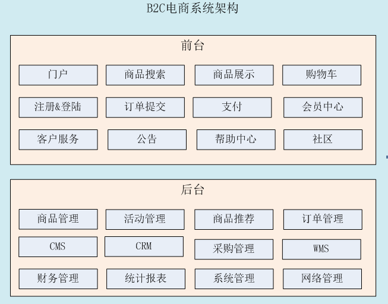
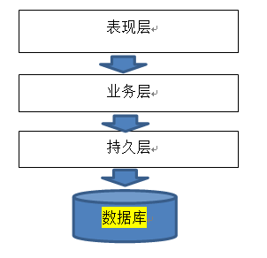
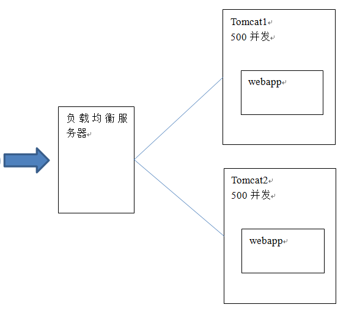
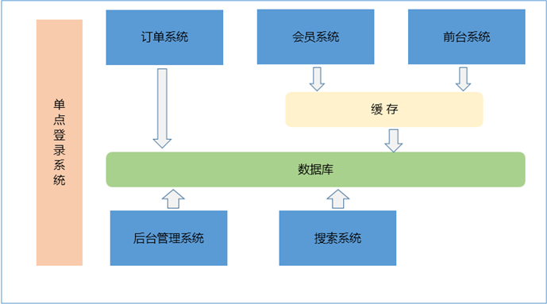
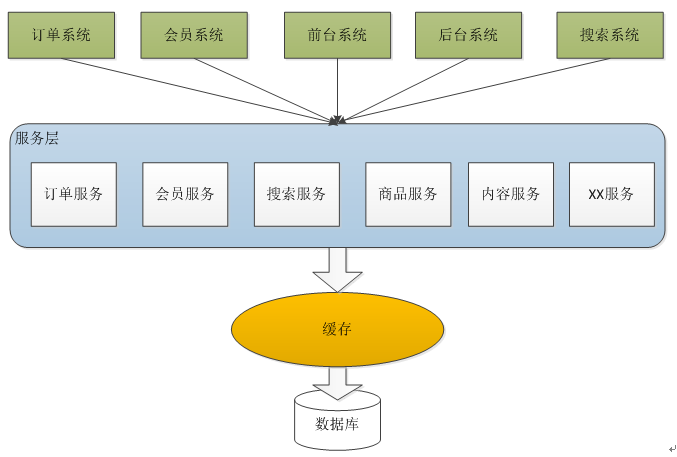
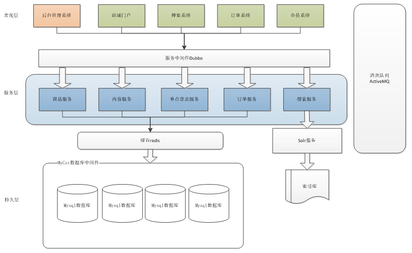

# 电商项目背景

# 电商行业技术特点

- 	技术新
- 	技术范围广
- 	分布式
- 	高并发、集群、负载均衡、高可用
- 	海量数据
- 	业务复杂
- 	系统安全
<!-- more -->
# 商城项目简介
商城是一个综合性的B2C平台，类似京东商城、天猫商城。会员可以在商城浏览商品、下订单，以及参加各种活动。  
管理员、运营可以在平台后台管理系统中管理商品、订单、会员等。  
客服可以在后台管理系统中处理用户的询问以及投诉。  

电商模式：  
B2B：商家到商家。阿里巴巴，慧聪网、铭万网。  
B2C：商家到用户。京东。  
C2C：用户到用户。淘宝。  
B2B2C：商家到商家到用户。天猫。  
O2O：线上到线下。百度外卖、美团、饿了么。  

# 项目架构
## 功能列表
后台管理系统：管理商品、订单、类目、商品规格属性、用户管理以及内容发布等功能。  
前台系统：用户可以在前台系统中进行注册、登录、浏览商品、首页、下单等操作。  
会员系统：用户可以在该系统中查询已下的订单、收藏的商品、我的优惠券、团购等信息。  
订单系统：提供下单、查询订单、修改订单状态、定时处理订单。  
搜索系统：提供商品的搜索功能。  
单点登录系统：为多个系统之间提供用户登录凭证以及查询登录用户的信息  

## 系统架构
### 传统架构

#### 1000并发

对于传统架构进行开发，假设每台tomcat服务器的最大并发访问量是500，那么1000并发就需要2台服务器做tomcat集群。

#### 10000并发

需要20台服务器做tomcat集群。当tomcat集群中节点数量增加，服务能力先增加后下降。  
所以集群中节点数量不能太多，一般也就5个左右。

需要按照功能点把系统拆分，拆分成独立的功能。单独为某一个节点添加服务器。需要系统之间配合才能完成整个业务逻辑。叫做分布式。

分布式架构：多个子系统相互协作才能完成业务流程。系统之间需要进行通信。  
集群：同一个工程部署到多台服务器上。  
分布式架构：  
把系统按照模块拆分成多个子系统。  
优点：  
1、把模块拆分，使用接口通信，降低模块之间的耦合度。  
2、把项目拆分成若干个子项目，不同的团队负责不同的子项目。  
3、增加功能时只需要再增加一个子项目，调用其他系统的接口就可以。  
4、可以灵活的进行分布式部署。  

缺点：  
1、系统之间交互需要使用远程通信，接口开发增加工作量。  
2、各个模块有一些通用的业务逻辑无法共用。  

### soa架构

SOA：Service Oriented Architecture面向服务的架构。也就是把工程拆分成服务层、表现层两个工程。服务层中包含业务逻辑和持久层，只需要对外提供服务即可。表现层只需要处理和页面的交互，业务逻辑都是调用服务层的服务来实现。

### 商城架构
商城的架构是基于soa架构，表现层就是该项目的各个功能模块，把业务逻辑放在单独的服务层，当然，该层还包含了DAO的的相关处理。其中dubbo是alibaba的一个中间件，类似于webservice，因为表现层和服务层已经分开，所以当需要调用相关业务的时候，需要我们进行相关协议的调用。当用户的并发搜索量很大的时候，可以使用Redis进行全文检索。

# 工程搭建——maven工程

