# 1. 桶排序
  期末考试完了老师要将同
学们的分数按照从高到低排序。小哼的班上只有 5个同学，这  5个同学分别考了  5分、3分、
5分、2分和   8分，哎考得真是惨不忍睹（满分是 10分）。接下来将分数进行从大到小排序，
排序后是 8 5 5 3 2。你有没有什么好方法编写一段程序，让计算机随机读入 5个数然后将这
5个数从大到小输出？请先想一想，至少想  15分钟再往下看吧(*^__^*)。
<!-- more -->
  
我们这里只需借助一个一维数组就可以解决这个问题。  

首先我们需要申请一个大小为 11的数组  int a[11]。OK，现在你已经有了 11个变量，编
号从 a[0]~a[10]。刚开始的时候，我们将 a[0]~a[10]都初始化为 0，表示这些分数还都没有人
得过。例如 a[0]等于 0就表示目前还没有人得过  0分，同理  a[1]等于 0就表示目前还没有人
得过 1分……a[10]等于  0就表示目前还没有人得过  10分。  
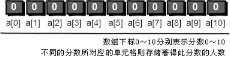   
下面开始处理每一个人的分数，第一个人的分数是 5分，我们就将相对应的  a[5]的值在
原来的基础增加 1，即将 a[5]的值从 0改为  1，表示 5分出现过了一次。   
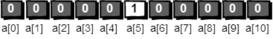  
第二个人的分数是 3分，我们就把相对应的  a[3]的值在原来的基础上增加  1，即将  a[3]
的值从 0改为  1，表示 3分出现过了一次。
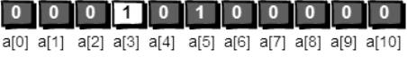     
注意啦！第三个人的分数也是 5分，所以  a[5]的值需要在此基础上再增加  1，即将  a[5]
的值从 1改为  2，表示 5分出现过了两次。   
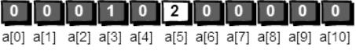  
按照刚才的方法处理第四个和第五个人的分数。最终结果就是下面这个图啦。
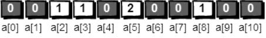     
你发现没有，a[0]~a[10]中的数值其实就是 0分到  10分每个分数出现的次数。接下来，
我们只需要将出现过的分数打印出来就可以了，出现几次就打印几次，具体如下。  
a[0]为 0，表示“0”没有出现过，不打印。  
a[1]为 0，表示“1”没有出现过，不打印。  
a[2]为 1，表示“2”出现过 1次，打印  2。  
a[3]为 1，表示“3”出现过 1次，打印  3。  
a[4]为 0，表示“4”没有出现过，不打印。  
a[5]为 2，表示“5”出现过 2次，打印  5 5。  
a[6]为 0，表示“6”没有出现过，不打印。  
a[7]为 0，表示“7”没有出现过，不打印。  
a[8]为 1，表示“8”出现过 1次，打印  8。  
a[9]为 0，表示“9”没有出现过，不打印。  
a[10]为 0，表示“10”没有出现过，不打印。  
最终屏幕输出“2 3 5 5 8”，完整的代码如下。  
代码如下（C++）：
``` java

#include <stdio.h>
int main()
{
int a[11],i,j,t;
for(i=0;i<=10;i++)
a[i]=0;  //初始化为0
for(i=1;i<=5;i++)  //循环读入5个数
{
scanf("%d",&t);  //把每一个数读到变量t中
a[t]++;  //进行计数
}
for(i=0;i<=10;i++)  //依次判断a[0]~a[10]
for(j=1;j<=a[i];j++)  //出现了几次就打印几次
printf("%d ",i);
getchar();getchar();
//这里的getchar();用来暂停程序，以便查看程序输出的内容
//也可以用system("pause");等来代替
return 0;
}
 
```   
输入数据为：   
`5 3 5 2 8   `   
这种排序方法我们暂且叫它“桶排序”。因为其实真正的桶排序要比这个复杂一些，以
后再详细讨论，目前此算法已经能够满足我们的需求了。   
这个算法就好比有 11个桶，编号从  0~10。每出现一个数，就在对应编号的桶中放一个
小旗子，最后只要数数每个桶中有几个小旗子就 OK了。例如  2号桶中有  1个小旗子，表示
2出现了一次；3号桶中有   1个小旗子，表示 3出现了一次；5号桶中有   2个小旗子，表示   5
出现了两次；8号桶中有  1个小旗子，表示  8出现了一次。   
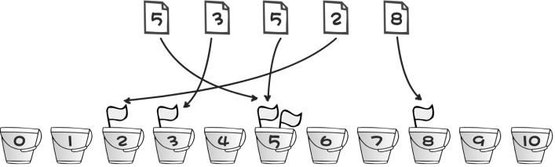   
如果需要对数据范围在 0~1000之间的整数进行排序，我们需要   1001个桶，来表示   0~1000
之间每一个数出现的次数，这一点一定要注意。另外，此处的每一个桶的作用其实就是“标
记”每个数出现的次数，因此我喜欢将之前的数组 a换个更贴切的名字   book（book这个单
词有记录、标记的意思），代码实现如下。  
``` c++
#include <stdio.h>
int main()
{
int book[1001],i,j,t,n;
for(i=0;i<=1000;i++)
book[i]=0;
scanf("%d",&n);//输入一个数n，表示接下来有n个数
for(i=1;i<=n;i++)//循环读入n个数，并进行桶排序
{
scanf("%d",&t);  //把每一个数读到变量t中
book[t]++;  //进行计数，对编号为t的桶放一个小旗子
}
for(i=1000;i>=0;i--)  //依次判断编号1000~0的桶
for(j=1;j<=book[i];j++)  //出现了几次就将桶的编号打印几次
printf("%d ",i);
getchar();getchar();
return 0;
}

```   
可以输入以下数据进行验证。  
`10
8 100 50 22 15 6 1 1000 999 0
`  
运行结果是：  
`1000 999 100 50 22 15 8 6 1 0`

## 时间复杂度
代码中第 一次for循环一共循环了 m次（m为桶的个数），
第 9行的代码循环了  n次（n为待排序数的个数），第  二次和第三次for一共循环了  m+n次。
所以整个排序算法一共执行了 m+n+m+n次。我们用大写字母  O来表示时间复杂度，因此该算法的时间复杂度是 O(m+n+m+n)即 O(2*(m+n))。我们在说时间复杂度的时候可以忽略较小
的常数，最终桶排序的时间复杂度为 O(m+n)。还有一点，在表示时间复杂度的时候，n和  m
通常用大写字母即 O(M+N)。   
这是一个非常快的排序算法。桶排序从 1956年就开始被使用，该算法的基本思想是由
E.J.Issac和  R.C.Singleton提出来的。之前我说过，其实这并不是真正的桶排序算法，真正的
桶排序算法要比这个更加复杂。但是考虑到此处是算法讲解的第一篇，我想还是越简单易懂
越好，真正的桶排序留在以后再聊吧。需要说明一点的是：我们目前学习的简化版桶排序算
法，其本质上还不能算是一个真正意义上的排序算法。为什么呢？例如遇到下面这个例子就
没辙了。  
现在分别有 5个人的名字和分数：huhu  5分、haha 3分、xixi  5分、hengheng 2分和   gaoshou
8分。请按照分数从高到低，输出他们的名字。即应该输出  gaoshou、huhu、xixi、haha、hengheng。
发现问题了没有？如果使用我们刚才简化版的桶排序算法仅仅是把分数进行了排序。最终输
出的也仅仅是分数，但没有对人本身进行排序。也就是说，我们现在并不知道排序后的分数
原本对应着哪一个人！这该怎么办呢？不要着急，请看下节——冒泡排序。

# 2. 邻居好说话——冒泡排序

简化版的桶排序不仅仅有上一节所遗留的问题，更要命的是：它非常浪费空间！例如需
要排序数的范围是 0~2100000000之间，那你则需要申请  2100000001个变量，也就是说要写
成 int a[2100000001]。因为我们需要用 2100000001个“桶”来存储  0~2100000000之间每一
个数出现的次数。即便只给你 5个数进行排序（例如这  5个数是  1、1912345678、2100000000、
18000000和  912345678），你也仍然需要 2100000001个“桶”，这真是太浪费空间了！还有，
如果现在需要排序的不再是整数而是一些小数，比如将  5.56789、2.12、1.1、3.123、4.1234
这五个数进行从小到大排序又该怎么办呢？现在我们来学习另一种新的排序算法：冒泡排
序。它可以很好地解决这两个问题。   
   
冒泡排序的基本思想是：每次比较两个相邻的元素，如果它们的顺序错误就把它们交换
过来。  

例如我们需要将 12 35 99  18 76这  5个数进行从大到小的排序。既然是从大到小排序，
也就是说越小的越靠后，你是不是觉得我在说废话，但是这句话很关键(∩_∩)。    

首先比较第 1位和第  2位的大小，现在第  1位是 12，第 2位是  35。发现 12比  35要小， 
因为我们希望越小越靠后嘛，因此需要交换这两个数的位置。交换之后这   5个数的顺序是  
35 12 99 18 76。  

按照刚才的方法，继续比较第 2位和第  3位的大小，第  2位是  12，第 3位是  99。12比
99要小，因此需要交换这两个数的位置。交换之后这  5个数的顺序是  35 99 12 18 76。

根据刚才的规则，继续比较第 3位和第  4位的大小，如果第  3位比第 4位小，则交换位
置。交换之后这 5个数的顺序是  35 99 18 12 76。

最后，比较第 4位和第  5位。4次比较之后  5个数的顺序是  35 99 18 76 12。

经过 4次比较后我们发现最小的一个数已经就位（已经在最后一位，请注意   12这个数
的移动过程），是不是很神奇。现在再来回忆一下刚才比较的过程。每次都是比较相邻的两
个数，如果后面的数比前面的数大，则交换这两个数的位置。一直比较下去直到最后两个数
比较完毕后，最小的数就在最后一个了。就如同是一个气泡，一步一步往后“翻滚”，直到
最后一位。所以这个排序的方法有一个很好听的名字“冒泡排序”。
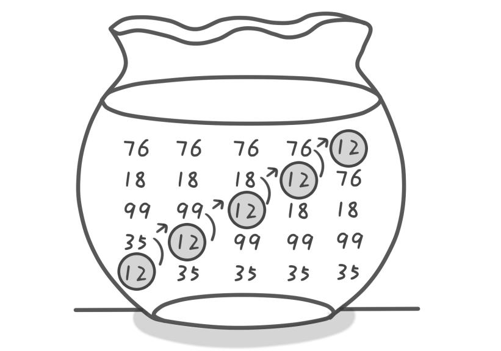 

说到这里其实我们的排序只将 5个数中最小的一个归位了。每将一个数归位我们将其称为“一趟”。下面我们将继续重复刚才的过程，将剩下的 4个数一一归位。

好，现在开始“第二趟”，目标是将第 2小的数归位。首先还是先比较第  1位和第  2位，
如果第 1位比第  2位小，则交换位置。交换之后这  5个数的顺序是 99 35 18 76 12。接下来你
应该都会了，依次比较第 2位和第  3位，第  3位和第  4位。注意此时已经不需要再比较第   4
位和第 5位。因为在第一趟结束后已经可以确定第  5位上放的是最小的了。第二趟结束之后
这 5个数的顺序是  99 35 76 18 12。

“第三趟”也是一样的。

第三趟之后这 5个数的顺序是  99 76 35 18 12。

现在到了最后一趟“第四趟”。有的同学又要问了，这不是已经排好了吗？还要继续？

当然，这里纯属巧合，你若用别的数试一试可能就不是了。你能找出这样的数据样例来吗？
请试一试。

**“冒泡排序”的原理是**：每一趟只能确定将一个数归位。即第一趟只能确定将末位上的
数（即第 5位）归位，第二趟只能将倒数第  2位上的数（即第  4位）归位，第三趟只能将倒
数第 3位上的数（即第  3位）归位，而现在前面还有两个位置上的数没有归位，因此我们仍
然需要进行“第四趟”。
“第四趟”只需要比较第 1位和第   2位的大小。因为后面三个位置上的数归位了，现在
第 1位是  99，第 2位是  76，无需交换。这 5个数的顺序不变仍然是 99 76  35 18 12。到此排
序完美结束了，5个数已经有  4个数归位，那最后一个数也只能放在第  1位了。

最后我们总结一下：如果有 n个数进行排序，只需将   n1个数归位，也就是说要进行
n-1趟操作。而“每一趟”都需要从第  1位开始进行相邻两个数的比较，将较小的一个数放
在后面，比较完毕后向后挪一位继续比较下面两个相邻数的大小，重复此步骤，直到最后一
个尚未归位的数，已经归位的数则无需再进行比较（已经归位的数你还比较个啥，浪费表情）。

这个算法是不是很强悍？记得我每次拍集体照的时候就总是被别人换来换去的，当时特
别烦。不知道发明此算法的人当时的灵感是否来源于此。啰里吧嗦地说了这么多，下面是代
码。建议先自己尝试去实现一下看看，再来看我是如何实现的。

``` c++
#include <stdio.h>
int main()
{
int a[100],i,j,t,n;
scanf("%d",&n);  //输入一个数n，表示接下来有n个数
for(i=1;i<=n;i++)  //循环读入n个数到数组a中
scanf("%d",&a[i]);
//冒泡排序的核心部分
for(i=1;i<=n-1;i++) //n个数排序，只用进行n-1趟
{
for(j=1;j<=n-i;j++) //从第1位开始比较直到最后一个尚未归位的数，想一想为什
么到n-i就可以了。
{
if(a[j]<a[j+1]) //比较大小并交换
{  t=a[j]; a[j]=a[j+1]; a[j+1]=t;  }
}
}
for(i=1;i<=n;i++)  //输出结果
printf("%d ",a[i]);
getchar();getchar();
return 0;
}

```

可以输入以下数据进行验证。  
`10
8 100 50 22 15 6 1 1000 999 0
`
运行结果是：  
`0 1 6 8 15 22 50 100 999 1000`  
将上面代码稍加修改，就可以解决第 1节遗留的问题，如下。  
``` c++
#include <stdio.h>
struct student
{
char name[21];
char score;
};//这里创建了一个结构体用来存储姓名和分数
int main()
{
struct student a[100],t;
int i,j,n;
scanf("%d",&n); //输入一个数n
for(i=1;i<=n;i++) //循环读入n个人名和分数
scanf("%s %d",a[i].name,&a[i].score);
//按分数从高到低进行排序
for(i=1;i<=n-1;i++)
{
for(j=1;j<=n-i;j++)
{
if(a[j].score<a[j+1].score)//对分数进行比较
{  t=a[j]; a[j]=a[j+1]; a[j+1]=t;  }
}
}
for(i=1;i<=n;i++)//输出人名
printf("%s\n",a[i].name);
getchar();getchar();
return 0;
}

```

可以输入以下数据进行验证。  
`5
huhu 5
haha 3
xixi 5
hengheng 2
gaoshou 8
`

运行结果是：  
`gaoshou
huhu
xixi
haha
hengheng
`

冒泡排序的核心部分是双重嵌套循环。不难看出冒泡排序的时间复杂度是 O(N 2)。这是
一个非常高的时间复杂度。冒泡排序早在 1956年就有人开始研究，之后有很多人都尝试过
对冒泡排序进行改进，但结果却令人失望。如 Donald  E. Knuth（中文名为高德纳，1974年
图灵奖获得者）所说：“冒泡排序除了它迷人的名字和导致了某些有趣的理论问题这一事实
之外，似乎没有什么值得推荐的。”你可能要问：那还有没有更好的排序算法呢？不要走开，
请看下节——快速排序。

# 3. 最常用的排序——快速排序
上一节的冒泡排序可以说是我们学习的第一个真正的排序算法，并且解决了桶排序浪费
空间的问题，但在算法的执行效率上却牺牲了很多，它的时间复杂度达到了 O(N2)。假如我
们的计算机每秒钟可以运行 10亿次，那么对  1亿个数进行排序，桶排序只需要  0.1秒，而冒
泡排序则需要 1千万秒，达到  115天之久，是不是很吓人？那有没有既不浪费空间又可以快
一点的排序算法呢？那就是“快速排序”啦！光听这个名字是不是就觉得很高端呢？

假设我们现在对“6  1  2  7  9  3   4  5  10  8”这 10个数进行排序。首先在这个序列中随
便找一个数作为基准数（不要被这个名词吓到了，这就是一个用来参照的数，待会儿你就知
道它用来做啥了）。为了方便，就让第一个数 6作为基准数吧。接下来，需要将这个序列中
所有比基准数大的数放在 6的右边，比基准数小的数放在  6的左边，类似下面这种排列。

`3  1  2  5  4    6  9  7  10  8`

在初始状态下，数字 6在序列的第  1位。我们的目标是将  6挪到序列中间的某个位置，
假设这个位置是 k。现在就需要寻找这个 k，并且以第 k位为分界点，左边的数都小于等于 6，
右边的数都大于等于 6。想一想，你有办法可以做到这点吗？

给你一个提示吧。请回忆一下冒泡排序是如何通过“交换”一步步让每个数归位的。此
时你也可以通过“交换”的方法来达到目的。具体是如何一步步交换呢？怎样交换才既方便
又节省时间呢？先别急着往下看，拿出笔来，在纸上画画看。我高中时第一次学习冒泡排序
算法的时候，就觉得冒泡排序很浪费时间，每次都只能对相邻的两个数进行比较，这显然太
不合理了。于是我就想了一个办法，后来才知道原来这就是“快速排序”，请允许我小小地
自恋一下(^o^)。


方法其实很简单：分别从初始序列“6  1  2  7  9  3  4  5   10  8”两端开始“探测”。先从
右往左找一个小于 6的数，再从左往右找一个大于  6的数，然后交换它们。这里可以用两个
变量 i和 j，分别指向序列最左边和最右边。我们为这两个变量起个好听的名字“哨兵 i”和
“哨兵 j”。刚开始的时候让哨兵 i指向序列的最左边（即 i=1），指向数字 6。让哨兵 j指向序
列的最右边（即 j=10），指向数字 8。
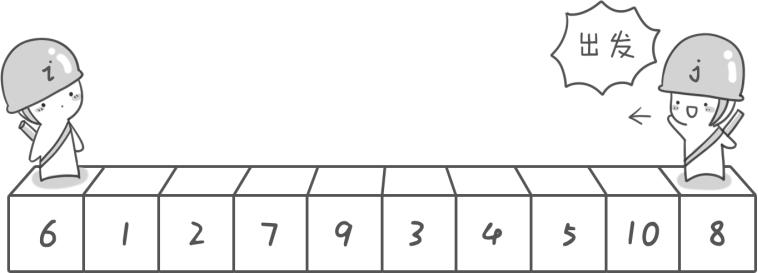   

首先哨兵 j开始出动。因为此处设置的基准数是最左边的数，所以需要让哨兵 j先出动，
这一点非常重要（请自己想一想为什么）。哨兵 j一步一步地向左挪动（即  j），直到找到
一个小于 6的数停下来。接下来哨兵  i再一步一步向右挪动（即 i++），直到找到一个大于   6
的数停下来。最后哨兵 j停在了数字  5面前，哨兵 i停在了数字  7面前。
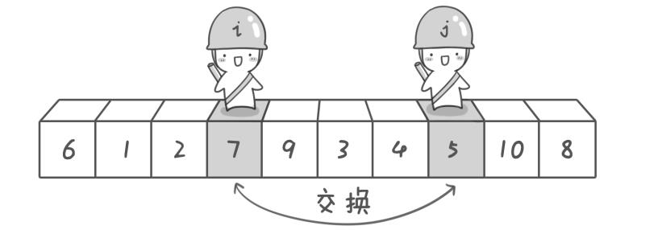
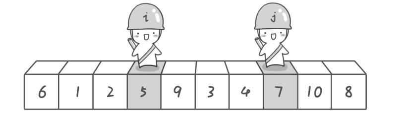

现在交换哨兵 i和哨兵 j所指向的元素的值。交换之后的序列如下。

`6  1  2    5  9  3  4    7  10  8`

到此，第一次交换结束。接下来哨兵 j继续向左挪动（再次友情提醒，每次必须是哨兵
j先出发）。他发现了  4（比基准数 6要小，满足要求）之后停了下来。哨兵  i也继续向右挪
动，他发现了 9（比基准数 6要大，满足要求）之后停了下来。此时再次进行交换，交换之
后的序列如下。

`6  1  2  5    4  3    9  7  10  8`

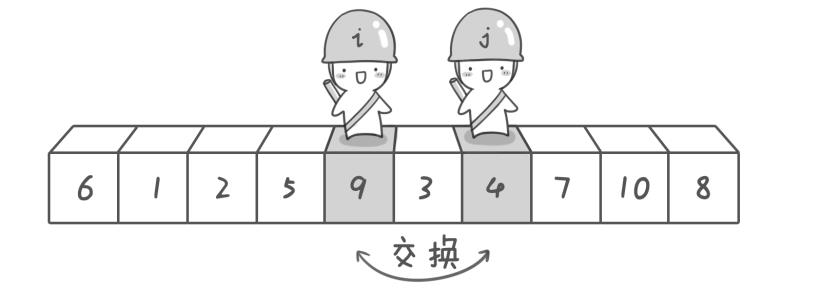
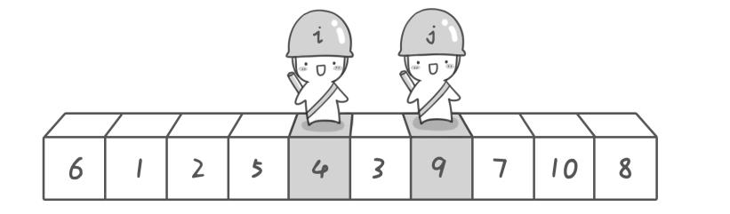

第二次交换结束，“探测”继续。哨兵 j继续向左挪动，他发现了  3（比基准数 6要小，
满足要求）之后又停了下来。哨兵 i继续向右移动，糟啦！此时哨兵  i和哨兵  j相遇了，哨
兵 i和哨兵  j都走到  3面前。说明此时“探测”结束。我们将基准数  6和  3进行交换。交换
之后的序列如下。

`3  1  2  5  4    6  9  7  10  8`

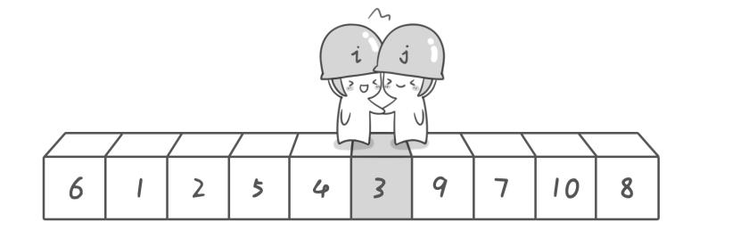
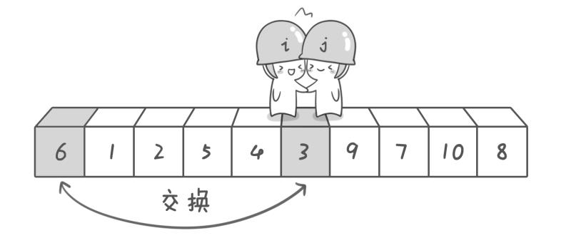
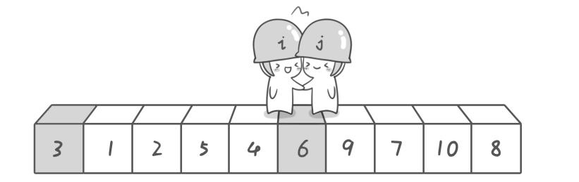

到此第一轮“探测”真正结束。此时以基准数 6为分界点，6左边的数都小于等于   6，6
右边的数都大于等于 6。回顾一下刚才的过程，其实哨兵 j的使命就是要找小于基准数的数，
而哨兵 i的使命就是要找大于基准数的数，直到 i和  j碰头为止。

OK，解释完毕。现在基准数 6已经归位，它正好处在序列的第   6位。此时我们已经将
原来的序列，以 6为分界点拆分成了两个序列，左边的序列是“3  1  2  5  4”，右边的序列是“9  7 10  8”。接下来还需要分别处理这两个序列，因为 6左边和右边的序列目前都还是很混
乱的。不过不要紧，我们已经掌握了方法，接下来只要模拟刚才的方法分别处理 6左边和右
边的序列即可。现在先来处理 6左边的序列吧。

左边的序列是“3  1 2  5  4”。请将这个序列以 3为基准数进行调整，使得  3左边的数都
小于等于 3，3右边的数都大于等于  3。好了开始动笔吧。

不用找纸了，别以为我不知道你的小伎俩，你肯定又没有动手尝试！就准备继续往下看
了吧。这里我留了一个空白区域，赶快自己动手模拟一下吧！

如果你模拟得没有错，调整完毕之后的序列的顺序应该是：

`2  1    3  5  4`

OK，现在 3已经归位。接下来需要处理  3左边的序列“2  1”和右边的序列“5  4”。对
序列“2 1”以 2为基准数进行调整，处理完毕之后的序列为“1 2”，到此 2已经归位。序列
“1”只有一个数，也不需要进行任何处理。至此我们对序列“ 2 1”已全部处理完毕，得到
的序列是“1 2”。序列“5 4”的处理也仿照此方法，最后得到的序列如下。

`1  2  3  4  5  6  9  7  10  8`

对于序列“9  7 10  8”也模拟刚才的过程，直到不可拆分出新的子序列为止。最终将会
得到这样的序列：

`1  2  3  4  5  6  7  8  9  10`

到此，排序完全结束。细心的同学可能已经发现，快速排序的每一轮处理其实就是将这
一轮的基准数归位，直到所有的数都归位为止，排序就结束了。下面上个霸气的图来描述下
整个算法的处理过程。

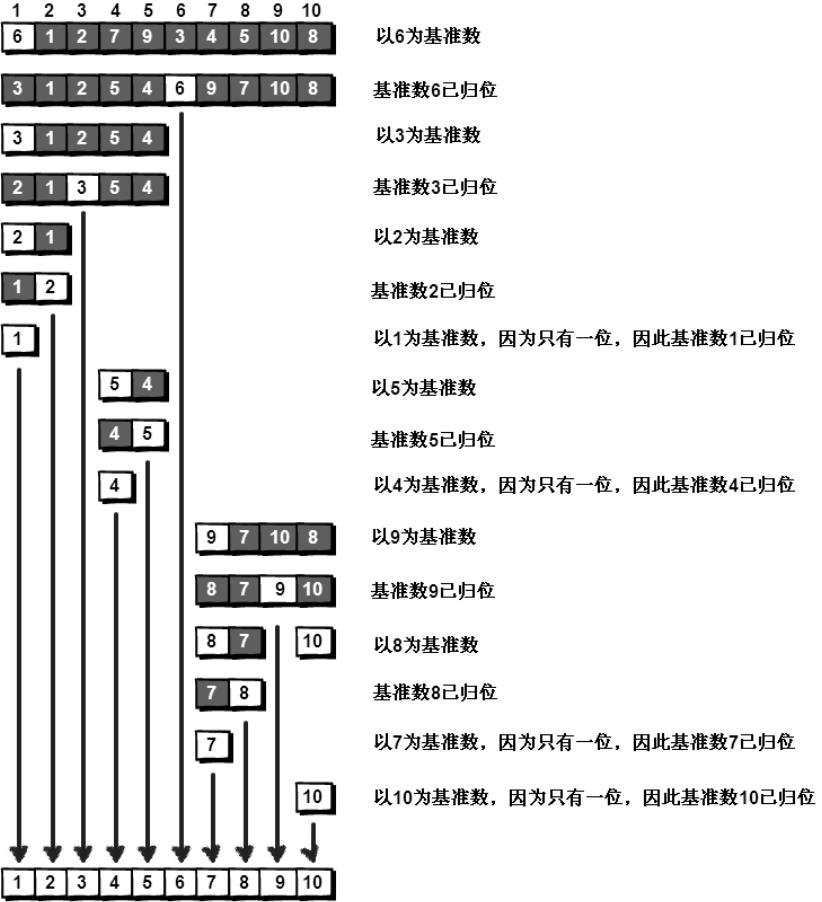

快速排序之所以比较快，是因为相比冒泡排序，每次交换是跳跃式的。每次排序的时候
设置一个基准点，将小于等于基准点的数全部放到基准点的左边，将大于等于基准点的数全
部放到基准点的右边。这样在每次交换的时候就不会像冒泡排序一样只能在相邻的数之间进
行交换，交换的距离就大得多了。因此总的比较和交换次数就少了，速度自然就提高了。当
然在最坏的情况下，仍可能是相邻的两个数进行了交换。因此快速排序的最差时间复杂度和
冒泡排序是一样的，都是 O(N2)，它的平均时间复杂度为 O (NlogN)。其实快速排序是基于一
种叫做“二分”的思想。我们后面还会遇到“二分”思想，到时候再聊。先上代码，如下。

``` c++
#include <stdio.h>
int a[101],n;//定义全局变量，这两个变量需要在子函数中使用
void quicksort(int left,int right)
{
int i,j,t,temp;
if(left>right)
return;
temp=a[left]; //temp中存的就是基准数
i=left;
j=right;
while(i!=j)
{
//顺序很重要，要先从右往左找
while(a[j]>=temp && i<j)
j--;
//再从左往右找
while(a[i]<=temp && i<j)
i++;
//交换两个数在数组中的位置
if(i<j)//当哨兵i和哨兵j没有相遇时
{
t=a[i];
a[i]=a[j];
a[j]=t;
}
}
//最终将基准数归位
a[left]=a[i];
a[i]=temp;
quicksort(left,i-1);//继续处理左边的，这里是一个递归的过程
quicksort(i+1,right);//继续处理右边的，这里是一个递归的过程
}
int main()
{
int i,j,t;
//读入数据
scanf("%d",&n);
for(i=1;i<=n;i++)
scanf("%d",&a[i]);
quicksort(1,n); //快速排序调用
//输出排序后的结果
for(i=1;i<=n;i++)
printf("%d ",a[i]);
getchar();getchar();
return 0;
}

```

可以输入以下数据进行验证。

`10
6  1  2  7  9  3  4  5  10  8
`

运行结果是：

`1 2 3 4 5 6 7 8 9 10`

下面是程序执行过程中数组 a的变化过程，带下划线的数表示的是已归位的基准数。

``` java
6 1 2 7 9 3 4 5 10 8
3 1 2 5 4  6 9 7 10 8
2 1  3 5 4 6 9 7 10 8
1  2 3 5 4 6 9 7 10 8
1 2 3 5 4 6 9 7 10 8
1 2 3 4 5 6 9 7 10 8
1 2 3 4 5 6 9 7 10 8
1 2 3 4 5 6 8 7 9  10
1 2 3 4 5 6 7 8 9 10
1 2 3 4 5 6 7 8 9 10
1 2 3 4 5 6 7 8 9  10

```

快速排序由 C. A. R. Hoare（东尼•霍尔，Charles Antony Richard Hoare）在 1960年提出，
之后又有许多人做了进一步的优化。如果你对快速排序感兴趣，可以去看看东尼•霍尔
1962年在  Computer Journal发表的论文“Quicksort”以及《算法导论》的第七章。快速排序
算法仅仅是东尼•霍尔在计算机领域才能的第一次显露，后来他受到了老板的赏识和重用，
公司希望他为新机器设计一种新的高级语言。你要知道当时还没有 PASCAL或者   C语言这
些高级的东东。后来东尼•霍尔参加了由 Edsger  Wybe Dijkstra（1972年图灵奖得主，这个
大神我们后面还会遇到的，到时候再细聊）举办的 ALGOL 60培训班，他觉得自己与其没有
把握地去设计一种新的语言，还不如对现有的 ALGOL 60进行改进，使之能在公司的新机器
上使用。于是他便设计了 ALGOL 60的一个子集版本。这个版本在执行效率和可靠性上都在
当时 ALGOL 60的各种版本中首屈一指，因此东尼•霍尔受到了国际学术界的重视。后来他
在  ALGOL X的设计中还发明了大家熟知的   case语句，也被各种高级语言广泛采用，比如
PASCAL、C、Java语言等等。当然，东尼•霍尔在计算机领域的贡献还有很多很多，他在
1980年获得了图灵奖。


 


